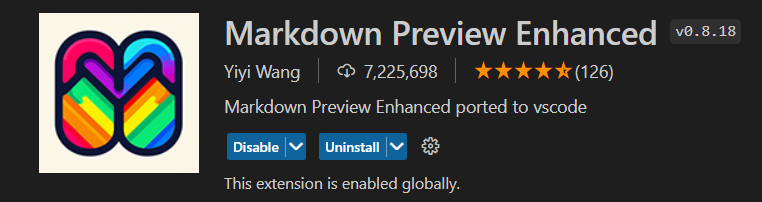
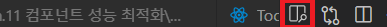
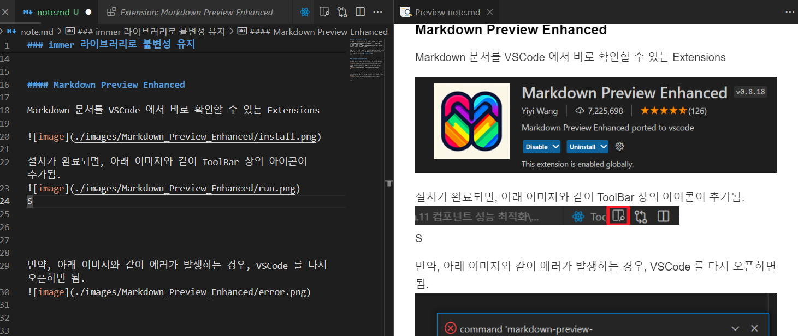
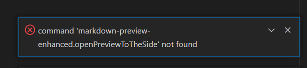

### immer 라이브러리로 불변성 유지

불변성을 유지해야하는 이유는 Ch.11 에서 아래와 같이 다뤘다.

> 리액트에서 컴포넌트의 상태를 업데이트할 때, 중요한 점은 불변성을 지키는 것이다.
불변성을 지키는 것은 기존 객체에 수정하는 것이 아닌, 새로운 객체를 만들어서 사용하는 것이다.


위와 같은 이유로 불변성을 유지하는 것이 중요한데, state 객체의 깊이가 깊은 경우, 이를 일일히 작성하는 것은 비효율적이다.

이를 도와주는 라이브러리가 **immer** 이다.
<hr>

```
yarn add immer
```
<br>

#### immer 를 사용하지 않고 불변성 유지
먼저 immer 라이브러리를 사용하지 않고, 불변성을 유지하는 소스이다.

<div style="height: 30px; line-height: 30px; font-weight: bold; padding-left:10px; background-color:#DCFFE4;">App.tsx</div>

```
import React, { useCallback, useRef, useState } from 'react';

interface IInfo {
  id: number,
  name: string,
  username: string
}
interface IData {
  array: Array<IInfo>,
  uselessValue: boolean | null
}

const App = () => {
  const nextId = useRef(1);
  const [form, setForm] = useState({name: '', username: ''});
  const [data, setData] = useState<IData>({
    array: [],
    uselessValue: null
  });

  const onChange = useCallback((e: any) => {
    const {name, value} = e.target;
    setForm({
      ...form,
      [name]: [value]
    })
  }, [form]);

  const onSubmit = useCallback((e: any) => {
    e.preventDefault();
    const info = {
      id: nextId.current,
      name: form.name,
      username: form.username
    }

    setData({
      ...data,
      array: data.array.concat(info)
    });

    setForm({name: '', username: ''});
    nextId.current += 1;
  }, [data, form.name, form.username]);

  const onRemove = useCallback((id: number) => {
    setData({
      ...data,
      array: data.array.filter(info => info.id !== id)
    });
  }, [data]);

  return (
    <>
      <form onSubmit={onSubmit}>
        <input
          name="username"
          placeholder='ID'
          value={form.username}
          onChange={onChange}
        />
        <input
          name="name"
          placeholder='Name'
          value={form.name}
          onChange={onChange}
        />
        <button type='submit'>Submit</button>
      </form>
      <div>
        <ul>
          {data.array.map((info: IInfo) => {
            return <li key={info.id} onClick={() => {onRemove(info.id)}}>
              {info.username} ({info.name})
            </li>
          })}
        </ul>
      </div>
    </>
  );
};

export default App;
```

위와 같이 라이브러리를 사용하지 않고도 불변성을 유지할 수 있다.
하지만, data 의 깊이가 Depth 가 깊어지면, 너무 불필요한 작업이 늘어난다.

<br/>

#### immer 라이브러리
```
import { produce } from 'immer';
const nextState = produce(originalState, (draft: any) => {
    draft.data.name = value;
});

// originalState: 수정할 State
// Parameter Function: 상태 업데이트 Function
```

위와 같이 작성하면, produce 내부에서 새로운 상태로 생성하면서 불변성을 유지해준다.
<br/>


<div style="height: 30px; line-height: 30px; font-weight: bold; padding-left:10px; background-color:#DCFFE4;">App.tsx</div>

```
import { produce } from 'immer';
import React, { useCallback, useRef, useState } from 'react';

interface IInfo {
  id: number,
  name: string,
  username: string
}
interface IData {
  array: Array<IInfo>,
  uselessValue: boolean | null
}

const App = () => {
  const nextId = useRef(1);
  const [form, setForm] = useState({name: '', username: ''});
  const [data, setData] = useState<IData>({
    array: [],
    uselessValue: null
  });

  const onChange = useCallback((e: any) => {
    const {name, value} = e.target;
    setForm(
      produce(form, (draft: any) => {
        draft[name] = value;
      })
    );
  }, [form]);

  const onSubmit = useCallback((e: any) => {
    e.preventDefault();
    const info = {
      id: nextId.current,
      name: form.name,
      username: form.username
    }

    setData(
      produce(data, (draft: any) => {
        draft.array.push(info);
      })
    );

    setForm({name: '', username: ''});
    nextId.current += 1;
  }, [data, form.name, form.username]);

  const onRemove = useCallback((id: number) => {
    setData(
      produce(data, (draft: any) => {
        draft.array.splice(draft.array.findIndex((info: IInfo) => info.id === id), 1);
      })
    );
  }, [data]);

  return (
    <>
      <form onSubmit={onSubmit}>
        <input
          name="username"
          placeholder='ID'
          value={form.username}
          onChange={onChange}
        />
        <input
          name="name"
          placeholder='Name'
          value={form.name}
          onChange={onChange}
        />
        <button type='submit'>Submit</button>
      </form>
      <div>
        <ul>
          {data.array.map((info: IInfo) => {
            return <li key={info.id} onClick={() => {onRemove(info.id)}}>
              {info.username} ({info.name})
            </li>
          })}
        </ul>
      </div>
    </>
  );
};

export default App;
```
<br/>

#### immer 라이브러리 & 함수형 업데이트

Ch.11 에서 함수형 업데이트에 대해서 언급했다.

```
const [number, setNumber] = useState(0);
const onIncrease = useCallback(() => setNumber(prev => prev + 1), []);
```
[참조 링크] https://velog.io/@tjdgus0528/React-Native-5x048oii


produce 의 첫 번째 파라미터가 함수 형태인 경우, 함수형 업데이트를 반환한다.
```
const update = produce((draft: any) => {
    draft.value = 2;
});
const data = {
    value: 1,
    name: 'abc'
}

const newState = update(data);
console.log(newState);      // {value: 2, name: abc}
```

이를 활용해, 보다 간결한 코드가 가능하다.


<hr>

#### Markdown Preview Enhanced
 
Markdown 문서를 VSCode 에서 바로 확인할 수 있는 Extensions



설치가 완료되면, 아래 이미지와 같이 ToolBar 상의 아이콘이 추가됨.




만약, 아래 이미지와 같이 에러가 발생하는 경우, VSCode 를 다시 오픈하면 됨.


[참조 링크] https://stackoverflow.com/questions/69074780/cant-open-markdown-preview-in-vscode