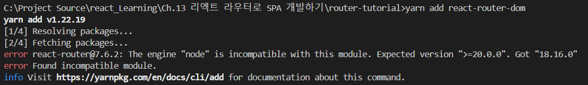

### 리액트 라우터로 SPA 개발하기

> SPA 는 단 하나의 페이지로 구성된 Application 을 의미

기존에는 페이지 이동이나 로딩할 때마다, html 과 서버에서 리소스를 받아와 해석해 렌더링하는 등의 과정을 거쳤다.
하지만, 화면 이동이 많거나, 모던 웹 애플리케이션의 경우 이런 과정에 속도가 느리거나 과부하가 발생할 수 있다.

따라서, 요즘에는 <b>필요한 부분만 자바스크립트에서 변환해주는 방식을 사용한다.</b>


이 때, 한 화면이 아닌 동작에 따라 다른 주소의 다른 화면을 보여주는 과정을 **라우팅** 이라고 한다.
리액트는 라우터를 내장하지 않고 있고, 외부 라이브러리(react-router, Next.js) 을 사용한다.

<hr/>

### SPA 단점
1) App 규모가 커지면, JS 파일이 커진다.
모든 페이지 스크립트를 가지고 와야하기 때문에 ( 이는 코드 스플리팅(Code splitting) 으로 해결할 수 있다. )
 ※ 코드 스플리팅(Code splitting) : 라우트별로 파일을 분리하는 방법

2) JS 를 실행할 때까지, 페이지가 비어 있을 수 있다. (JS 파일이 로딩되는 동안, 흰 페이지가 나타날 수 있다.)
이는 서버 사이드 렌더링을 통해 해결가능하다.

<hr/>

### react-router
```
yarn add react-router-dom@6.15.0
```
<span style="font-size: 12px; color: #8C8C8C">※ 7.6.2 버전의 경우, 아래 오류가 발생 (6.15.0 으로 설치해서 사용)</span>



react-router-dom 을 적용하기 위해서는 우선, index.tsx 부분의 <App> 컴포넌트를 <BrowserRouter> 로 감싸주면 된다.
```
// index.tsx
<BrowserRouter>
    <App />
</BrowserRouter>
```
<br/>

책에서 나오는 나오는 버전은 v5 로 현재 v6 버전에서와 다르다.
```
(v5) <Route path='/' component={Home}/>
(v6) <Route path='/' element={<Home/>}/>
```

책에서는 Route 를 통해서만 구성이 가능했지만, 현재에서는 <Routes> 태그로 감싸놓아야만 한다.

<span style="font-size: 12px; color: #8C8C8C">※ v6 으로 올라가면서 변경된 사항들 
https://velog.io/@soryeongk/ReactRouterDomV6</span><br/><br/>


<div style="height: 30px; line-height: 30px; font-weight: bold; padding-left:10px; background-color:#DCFFE4;">App.tsx</div>

```
import { Route, Routes } from 'react-router-dom';
import Home from './Home';
import About from './About';

const App = () => {
  return (
    <div>
      <Routes>
        <Route path="/" element={<Home/>}/>
        <Route path="/about" element={<About/>}/>
      </Routes>
    </div>
  );
};

export default App;
```


<Link> 컴포넌트를 활용해, 다른 Path 로 이동할 수 있다.

```
<Link to="/about">About</Link>
```

v6 으로 올라가면서, 하나의 router 로 다중의 path 를 지원하는 기능은 더 이상 제공되지 않는다.
https://stackoverflow.com/questions/40541994/multiple-path-names-for-a-same-component-in-react-router

<hr/>

### URL 파라미터
페이지 이동 시, 값을 전달하는 방법으로는 파라미터와 쿼리 방식으로 가능하다.
<span style="font-size: 13px; color: #5D5D5D">* 파라미터 : /about/param</span>
<span style="font-size: 13px; color: #5D5D5D">* 쿼리 : /about?query=true</span>
<br/>

보통 파라미터는 조회할 때 사용하고, 쿼리는 검색 혹은 페이지 옵션을 전달할 때 사용한다.


<span style="font-size: 17px; color: black">1. URL 파라미터</sapn>
```
<Link to="/profile/velopert">Velopert Profile</Link>
<Route path='/profile/:username' element={<Profile/>}/>
```
라우팅 타겟 컴포넌트에서 값을 받는 과정은 v5, v6 이 다르다.
```
// v5
const Profile = ({ match }) => {
  const { username } = match.params;
}
// v6
const Profile = () => {
    const { username } = useParams();
}
```

<div style="height: 30px; line-height: 30px; font-weight: bold; padding-left:10px; background-color:#DCFFE4;">Profile.tsx</div>

```
import React, { useEffect, useState } from 'react';
import { useParams } from 'react-router-dom';

interface IUser {
    name: string,
    description: string
}
interface IData {
    [key: string]: IUser
}

const data: IData = {
    velopert: {
        name: "Tom",
        description: 'React'
    },
    gildong: {
        name: 'James',
        description: 'Vue'
    }
}
const Profile = () => {
    const [profile, setProfile] = useState<IUser | undefined>({
        name: '',
        description: '',
    });
    const { username } = useParams();

    useEffect(() => {
        if (typeof username === 'string' && data[username]) {
            setProfile(data[username]);
        } else {
            setProfile(undefined); // username이 없거나 잘못된 경우
        }
    }, [username]);

    if (!profile) {
        return <div>The user does not exist.</div>;
    }
    
    return (
        <div>
            <h3>{username}({profile.name})</h3>
            <p>
                {profile.description}
            </p>
        </div>
    );
};

export default Profile;
```